# Comunicación entre componentes

Este documento describe el flujo de mensajes y la arquitectura de comunicación entre los distintos componentes (padre e iframes hijos) de la aplicación Valencia VGuides.

---

## 1. Principios generales

- **Mensajería centralizada:** Todos los mensajes entre componentes se envían usando el sistema de mensajería basado en `window.postMessage` y los tipos definidos en `TIPOS_MENSAJE`.
- **Async/Await:** Toda función que use `await` debe ser `async`. Los manejadores de eventos y mensajes suelen ser funciones asíncronas.
- **Identificación:** Cada iframe hijo tiene un `iframeId` único y el padre usa `padre` como identificador.
- **Estado sincronizado:** El padre mantiene el estado global y orquesta la actualización de los hijos.

---

## 2. Patrón Async/Await para envío de mensajes

```javascript
// ❌ INCORRECTO - No se puede usar await en función no async
button.addEventListener('click', () => {
    await enviarMensaje('padre', TIPO_MENSAJE, datos);
});

// ✅ CORRECTO - Función anónima declarada como async
button.addEventListener('click', async () => {
    await enviarMensaje('padre', TIPO_MENSAJE, datos);
});
```

Lo mismo aplica para funciones nombradas:

```javascript
// ❌ INCORRECTO
function enviarDatos() {
    await enviarMensaje('padre', TIPO_MENSAJE, datos);
}

// ✅ CORRECTO
async function enviarDatos() {
    await enviarMensaje('padre', TIPO_MENSAJE, datos);
}
```

---

## 3. Flujo de comunicación entre componentes

### 3.1 Inicialización

1. Cada hijo llama a `inicializarMensajeria({ iframeId })` al arrancar.
2. Cuando está listo, envía `SISTEMA.COMPONENTE_LISTO` al padre.
3. El padre recibe el mensaje, registra el hijo como inicializado y puede responder con el estado global (`SISTEMA.ESTADO`).

### 3.2 Cambio de modo (Casa/Aventura)

1. Un hijo (normalmente hijo5-casa) solicita el cambio de modo con `SISTEMA.CAMBIO_MODO`.
2. El padre procesa el cambio, actualiza su estado y notifica a todos los hijos el nuevo modo.
3. Cada hijo actualiza su interfaz y lógica según el modo recibido.

### 3.3 Navegación entre paradas y tramos

1. El usuario selecciona una parada o tramo en hijo5-casa.
2. Se envía `NAVEGACION.CAMBIO_PARADA` al padre con el identificador único (`parada_id` o `tramo_id`).
3. El padre orquesta la actualización:
    - Actualiza el mapa (hijo1) con la nueva posición.
    - Actualiza el componente de coordenadas (hijo2).
    - Reproduce el audio correspondiente (hijo3).
    - Muestra el reto si corresponde (hijo4).

### 3.4 Solicitud y respuesta de datos

- Para obtener datos de paradas, tramos, retos, etc., los hijos envían mensajes como `DATOS.SOLICITAR_PARADAS` o `DATOS.SOLICITAR_PARADA`.
- El padre responde con `DATOS.RESPUESTA_PARADAS` o `DATOS.RESPUESTA_PARADA` según corresponda.

### 3.5 Retos y preguntas

1. El padre envía `RETO.MOSTRAR` a hijo4 para mostrar un reto.
2. hijo4 muestra la interfaz del reto.
3. Al completar, hijo4 envía `RETO.COMPLETADO` al padre.
4. El padre registra el progreso y puede coordinar el avance de la aventura.

---

## 4. Ejemplo de flujo completo

**Cambio de parada desde hijo5-casa:**

1. Usuario pulsa un botón de parada/tramo en hijo5-casa.
2. hijo5-casa envía:
   ```js
   await enviarMensaje('padre', TIPOS_MENSAJE.NAVEGACION.CAMBIO_PARADA, { punto: { parada_id, tramo_id } });
   ```
3. El padre recibe el mensaje y:
   - Actualiza el estado global.
   - Envía a hijo2 (coordenadas): `NAVEGACION.CAMBIO_PARADA` con el nuevo punto.
   - Envía a hijo3 (audio): `AUDIO.REPRODUCIR` con el audio correspondiente.
   - Envía a hijo4 (retos): `RETO.MOSTRAR` si hay reto asociado.
   - Actualiza el mapa con la nueva posición.

---

## 5. Resumen de tipos de mensajes principales

- `SISTEMA.COMPONENTE_LISTO`: Un hijo notifica que está listo.
- `SISTEMA.CAMBIO_MODO`: Solicitud o notificación de cambio de modo.
- `SISTEMA.ESTADO`: Estado global enviado por el padre.
- `NAVEGACION.CAMBIO_PARADA`: Cambio de parada/tramo.
- `DATOS.SOLICITAR_PARADAS` / `DATOS.RESPUESTA_PARADAS`: Solicitud/respuesta de lista de paradas.
- `DATOS.SOLICITAR_PARADA` / `DATOS.RESPUESTA_PARADA`: Solicitud/respuesta de datos de una parada/tramo.
- `AUDIO.REPRODUCIR`: Reproducir audio en hijo3.
- `RETO.MOSTRAR` / `RETO.COMPLETADO`: Mostrar/completar reto en hijo4.

---

## 6. Buenas prácticas

- **Siempre usar await** al enviar mensajes si esperas respuesta.
- **Registrar controladores** para cada tipo de mensaje relevante en cada componente.
- **Sincronizar el estado**: los hijos deben actualizar su UI al recibir mensajes de estado o cambio de modo.
- **Evitar duplicados**: cada mensaje debe tener un identificador único (`mensajeId`) y hash de contenido para evitar procesar dos veces el mismo mensaje.
- **Implementar throttling**: limitar la frecuencia de mensajes de alta frecuencia como actualizaciones GPS.
- **Responsividad**: los hijos deben adaptar su UI a móvil y escritorio.

## 7. Control de duplicados mejorado

El sistema implementa dos niveles de control de duplicados:

1. **Control por ID único**: Cada mensaje tiene un `mensajeId` único generado con alta entropía.
   ```javascript
   const mensajeId = generarIdUnico('navegacion');
   ```

2. **Control por contenido**: Para mensajes de navegación (especialmente GPS), se genera un hash del contenido relevante.
   ```javascript
   const contentHash = generarHashContenido(tipo, datos);
   ```

Este enfoque evita que mensajes duplicados (por ejemplo, actualizaciones GPS frecuentes) saturen el sistema cuando no hay cambios significativos.

## 8. Optimización para actualizaciones GPS

Las actualizaciones GPS implementan un throttling inteligente:
- Intervalo base de 10 segundos entre actualizaciones
- Envío inmediato cuando hay movimiento significativo (>5-10m)
- Control de duplicados basado en contenido para mensajes similares

Esto reduce significativamente:
- El consumo de batería
- El tráfico de mensajes
- La carga de procesamiento

---

## 9. Diagrama de comunicación (simplificado)

```mermaid
sequenceDiagram
    participant Casa as hijo5-casa
    participant Padre as padre
    participant Coord as hijo2
    participant Audio as hijo3
    participant Retos as hijo4

    Casa->>Padre: NAVEGACION.CAMBIO_PARADA
    Padre->>Coord: NAVEGACION.CAMBIO_PARADA
    Padre->>Audio: AUDIO.REPRODUCIR
    Padre->>Retos: RETO.MOSTRAR
    Padre->>Casa: SISTEMA.ESTADO
    Coord->>Padre: DATOS.SOLICITAR_PARADAS
    Padre->>Coord: DATOS.RESPUESTA_PARADAS
```



---

## 10. Referencias

- [js/constants.js](./constants.js)
- [js/mensajeria.js](./mensajeria.js)
- [js/app.js](./app.js)
- [js/funciones-mapa.js](./funciones-mapa.js)
- [js/logger.js](./logger.js)

---

**Este documento es la referencia para entender y depurar la comunicación entre los componentes de la app.**
